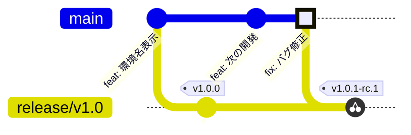

# 第4章 upstream first とバックポート

シナリオ: v1.0.0 が本番稼働中、main では次バージョンの開発が進んでいます
(第3章の最後で PR を 1 つマージしていれば、すでに main と release/v1.0 は
分岐しています)。ここで本番のバグが見つかりました。



原則は **upstream first**: 修正はまず main に入れ、それをリリースブランチへ
cherry-pick します。逆順 (リリースブランチだけ直す) にすると、次のリリースで
同じバグが再発する事故が起きます。

> [!IMPORTANT]
> **この章は「自分で控えた値」を使い回します。** 出てくるコマンドのうち
> `<ISSUE番号>` `<PR番号>` `<SHA>` の 3 つは**プレースホルダ**で、そのまま
> 実行しても動きません。番号や SHA は実行するたびに変わるので、本文の
> 表示例 (`#3` や `9f8e7d6` など) は**あなたの環境とは必ず違います**。
> 手元の出力から控えて置き換えてください。
> また、コマンドは**ブロック単位で 1 つずつ**実行してください
> (まとめてコピペすると、編集していないのに commit する等でつまずきます)。

## 4.1 バグを発見する

検品票をよく見ると、チェック行に **「version 一致」が 2 つ並んでいます**。

```
✓ version 一致    ✓ version 一致
```

2 行目が判定しているのは `git_sha` の一致 (`ok={shaMatch}`) なのに、ラベルだけが
コピペのまま `version 一致` になっているのが原因です。判定そのものは正しく
動いていますが、**票の読み手には git_sha が検品されたことが伝わりません**。
出荷検品票としては十分に「バグ」です。

`frontend/src/App.tsx`:

```tsx
      <section className="checks">
        <Check label="version 一致" ok={versionMatch} pending={!loaded} />
        <Check label="version 一致" ok={shaMatch} pending={!loaded} />   {/* ← "git_sha 一致" が正 */}
      </section>
```

**1. バグ報告の Issue を作る**

```bash
gh issue create \
  --title "検品票のチェック行に「version 一致」が 2 つ表示される" \
  --body "2 行目は git_sha を判定しているので「git_sha 一致」と表示するのが正。v1.0 系にもバックポートが必要"
```

**2. 発行された Issue 番号を控える**

コマンドの出力に Issue の URL が表示されます。**末尾の数字が Issue 番号**です
(`https://github.com/.../issues/3` なら `3`)。以降これを `<ISSUE番号>` と書きます。

## 4.2 まず main を直す (upstream first)

第1章とまったく同じ日常フローです。1 ブロックずつ実行してください。

**1. main から作業ブランチを切る**

```bash
git switch main && git pull
```

```bash
git switch -c fix/<ISSUE番号>-check-label
```

**2. `frontend/src/App.tsx` を編集する**

2 つ目の `Check` の `label` を `"git_sha 一致"` に直します
(**コマンドではありません。エディタで直してください**)。

```tsx
      <section className="checks">
        <Check label="version 一致" ok={versionMatch} pending={!loaded} />
        <Check label="git_sha 一致" ok={shaMatch} pending={!loaded} />   {/* ← ここを直す */}
      </section>
```

**3. コミットして push する**

```bash
git add frontend/src/App.tsx
git commit -m "チェック行のラベル修正"
```

```bash
git push -u origin fix/<ISSUE番号>-check-label
```

**4. PR を作る**

```bash
gh pr create \
  --title "fix: git_sha チェックのラベルが version 一致になっている" \
  --body "Closes #<ISSUE番号>"
```

**5. CI 通過を待ってマージする**

```bash
gh pr checks --watch
```

```bash
gh pr merge --squash
```

(ペア/研修モードでは、第1章と同じくレビュアーの Approve が付くまでマージできません)

**6. squash されたコミットの SHA と PR 番号を控える**

バックポートで cherry-pick するのは、いま main に入った**この 1 コミット**です。

```bash
git switch main && git pull
git log -1 --format='%h  %s'
```

表示例:

```
9f8e7d6  fix: git_sha チェックのラベルが version 一致になっている (#4)
```

左の 7 桁が `<SHA>`、末尾の `(#4)` の数字が `<PR番号>` です。
**上は表示例です。手元の出力に出た値を控えてください。**

dev の URL を開くと、チェック行が `✓ version 一致  ✓ git_sha 一致` になっています。
staging / production はまだ `version 一致` が 2 つ並んだままです — この差が、
これからバックポートするものです。

## 4.3 release/v1.0 へ cherry-pick する

リリースブランチも Ruleset で保護されているため、直 push はできません。
バックポートも **PR 経由**です。

**1. release/v1.0 からバックポート用ブランチを切る**

```bash
git switch release/v1.0 && git pull
```

```bash
git switch -c backport/v1.0-check-label
```

**2. main のコミットを cherry-pick する**

`<SHA>` を、4.2 の 6 で控えた 7 桁に置き換えてから実行します。

```bash
git cherry-pick -x <SHA>
```

> [!TIP]
> `-x` を付けると、コミットメッセージに `(cherry picked from commit ...)` が
> 追記され、main のどのコミット由来かの追跡が残ります。

> [!NOTE]
> `bad revision` や `unknown revision` で失敗するのは、`<SHA>` を置き換え忘れたか、
> main を pull していないためです。`git log --oneline main -5` で対象コミットが
> 見えるか確かめてください。

**3. 入ったコミットを確認する**

```bash
git show --stat HEAD
```

`(cherry picked from commit ...)` の行があり、変更が `frontend/src/App.tsx` の
1 ファイルだけであることを確認します。

**4. push する**

```bash
git push -u origin backport/v1.0-check-label
```

**5. PR 本文をバックポート用テンプレートから用意する**

テンプレートを作業用にコピーします。

```bash
cp .github/PULL_REQUEST_TEMPLATE/backport.md /tmp/backport-body.md
```

コピーしたファイルを開き、控えた値で 3 か所を埋めます。

```bash
code /tmp/backport-body.md
```

| テンプレートの行 | 埋める内容 |
| --- | --- |
| `- 元 PR: #` | 4.2 の 6 で控えた `<PR番号>` (例: `- 元 PR: #4`) |
| `- 対象リリースブランチ: release/vX.Y` | `release/v1.0` |
| `## cherry-pick したコミット` の下の `-` | 控えた `<SHA>` |

**6. base を release/v1.0 にして PR を作る**

```bash
gh pr create \
  --base release/v1.0 \
  --title "fix: git_sha チェックのラベルが version 一致になっている (backport v1.0)" \
  --body-file /tmp/backport-body.md
```

> [!WARNING]
> `--base release/v1.0` を落とすと **main 向けの PR** ができてしまい、バックポートに
> なりません。作成できたら base を確認してください。
>
> ```bash
> gh pr view --json baseRefName --jq .baseRefName
> ```
>
> `release/v1.0` と返れば OK です。違っていれば `gh pr edit --base release/v1.0`
> で直せます。

(UI で作る場合は PR 作成 URL の末尾に `?template=backport.md` を付けると
テンプレートが読み込まれます。base ブランチの選択を忘れずに)

**7. CI 通過後、squash merge する**

```bash
gh pr checks --watch
```

```bash
gh pr merge --squash
```

<details>
<summary>▶ ペア/研修モードの場合</summary>

バックポート PR のレビュー観点は通常 PR と異なります。「修正内容が正しいか」は
main 側 PR で審査済みなので、ここでは **(1) 元 PR と差分が一致しているか、
(2) 余計な変更が紛れ込んでいないか、(3) 対象ブランチが正しいか** だけを
確認して Approve してください。

</details>

## 4.4 v1.0.1 をリリースする

第3章と同じ手順の 2 周目です。タグ名は `v1.0.1-rc.1` / `v1.0.1` で固定なので、
置き換えは不要です。

> [!WARNING]
> **RC と GA を続けて打たないでください。** RC を staging で検品してから GA、が
> リリースブランチ方式の要点です。以下も 1 ブロックずつ実行します。

**1. release/v1.0 を最新にする** (バックポート PR のマージを取り込む)

```bash
git switch release/v1.0 && git pull
```

**2. ローカルと origin の先端が同じか確かめる** (2 行が同じ SHA なら OK)

```bash
git rev-parse HEAD origin/release/v1.0
```

**3. RC タグを打つ**

```bash
git tag v1.0.1-rc.1
git push origin v1.0.1-rc.1
```

**4. staging で検品する**

`Release RC` の完了を待って、**staging と production を並べて開いてください**。

| | チェック行 | version |
| --- | --- | --- |
| staging (v1.0.1) | `✓ version 一致  ✓ git_sha 一致` | 1.0.1 |
| production (v1.0.0) | `✓ version 一致  ✓ version 一致` | 1.0.0 |

修正が staging にだけ届いている状態が見えます。

**5. 同じコミットに GA タグを打つ**

```bash
git tag v1.0.1
git push origin v1.0.1
```

**6. 承認して production を確認する**

`Release GA` が `Waiting for review` で止まるので、第3章と同じく **Review deployments**
から承認します。デプロイ完了後、production 側のチェック行も `git_sha 一致` に
変わります。これがバックポートの着地確認です。

## 4.5 チェックポイント

- [ ] main に fix が入って dev に反映された (チェック行のラベルは次期バージョンでも直っている)
- [ ] `release/v1.0` には cherry-pick の 1 コミットだけが追加された
      (`git log --oneline main..release/v1.0` で確認 — 次期開発のコミットが**混ざっていない**)
- [ ] production の検品票が `version: 1.0.1` になり、チェック行が
      `✓ version 一致  ✓ git_sha 一致` に変わった
- [ ] main 側の開発内容 (第3章末の PR) は production に**出ていない**

最後の 2 点が、リリースブランチ方式の価値そのものです:
**修正だけを、開発中の変更を巻き込まずに出荷できました**。

---

← [第3章 v1.0 リリース](./03-release.md) | [第5章 発展演習 →](./05-advanced.md)
